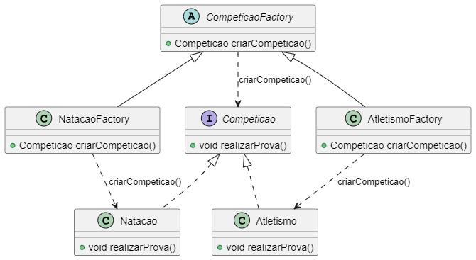
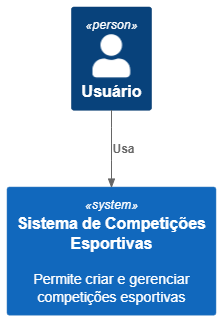
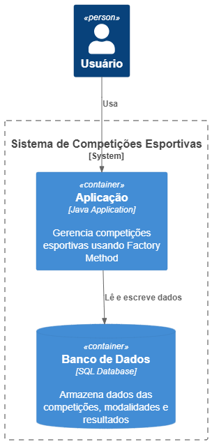
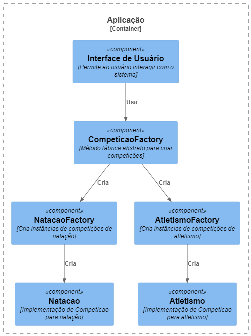

# Sports Competition Factory Method

Welcome to the **Sports Competition Factory Method** repository! This repository demonstrates the implementation of the Factory Method design pattern using Java to create different types of sports competitions.

## Purpose

The main purpose of this repository is to provide a clear and practical example of the Factory Method design pattern. The Factory Method pattern is essential in software development as it provides a way to delegate the instantiation of objects to subclasses, improving code flexibility and scalability.

## Structure

The repository is organized as follows:

```
SportsCompetitionFactory
├── bin
│   └── com
│       └── exemplo
│           ├── Atletismo.class
│           ├── AtletismoFactory.class
│           ├── Competicao.class
│           ├── CompeticaoFactory.class
│           ├── Main.class
│           ├── Natacao.class
│           └── NatacaoFactory.class
├── docs
│   └── C4Diagram
│       ├── diagrama_c4_nivel1.puml
│       ├── diagrama_c4_nivel2.puml
│       ├── diagrama_c4_nivel3.puml
│       ├── diagrama_c4_nivel4.puml
│       └── diagrama.puml
├── lib
├── src
│   └── com
│       └── exemplo
│           ├── Atletismo.java
│           ├── AtletismoFactory.java
│           ├── Competicao.java
│           ├── CompeticaoFactory.java
│           ├── Main.java
│           ├── Natacao.java
│           └── NatacaoFactory.java
└── README.md
```

## Design Patterns Covered

### Factory Method

The Factory Method pattern defines an interface for creating an object, but allows subclasses to alter the type of objects that will be created. It promotes loose coupling by eliminating the need to bind application-specific classes into the code. The code only interacts with the resulting objects through the interface.

### Classes

- **Competicao**: An abstract class representing the interface for competitions.
- **CompeticaoFactory**: An abstract class defining the factory method for creating competitions.
- **Atletismo**: A class representing an athletics competition.
- **AtletismoFactory**: A factory class for creating instances of Atletismo.
- **Natacao**: A class representing a swimming competition.
- **NatacaoFactory**: A factory class for creating instances of Natacao.
- **Main**: The main class demonstrating the use of the Factory Method pattern.

## UML Diagram



## C4 Diagrams

### Level 1


### Level 2


### Level 3


### Level 4


## Getting Started

### Prerequisites

- **Java Development Kit (JDK)**: Make sure you have JDK installed on your machine. You can download it from [here](https://www.oracle.com/java/technologies/javase-downloads.html).
- **PlantUML extension for VS Code**: Required to view the diagrams. You can install it from the VS Code marketplace.

### Running the Examples

1. Compile the Java files:
   ```bash
   javac -d bin -sourcepath src src/com/exemplo/*.java
   ```
2. Run the main class:
   ```bash
   java -cp bin com.exemplo.Main
   ```

## Explanation

The Factory Method pattern is a creational pattern that defines an interface for creating an object, but lets subclasses decide which class to instantiate. This pattern lets a class defer instantiation to subclasses.

### Example from the Code

In this project, we have an abstract class `Competicao` and an abstract factory `CompeticaoFactory`. Concrete classes `Atletismo` and `Natacao` extend `Competicao`, and their respective factories `AtletismoFactory` and `NatacaoFactory` implement the factory method to create instances of these classes.
